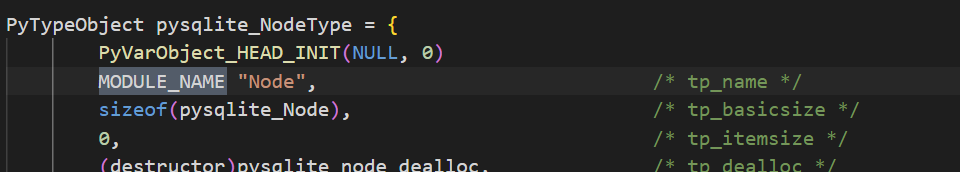
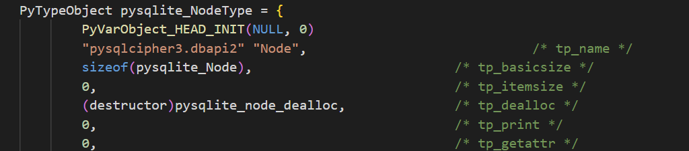

# pysqlcipher3-for-windows
With this REPO I'm trying to make life easier for all developers who need pysqlcipher3 on Windows OS.<br>
This guide is a collection of information you learned online and from other people's guides around the world.

## Contents

*   [What is this?](#what-is-this)
*   [Getting started](#getting-started)
    *   [Requirements](#requirements)
    *   [Installation](#installation)
          *  [Fast Installation](#fast-installation)
          *  [Normal Installation](#normal-installation)
    *   [Build](#building-for-source)


## What is this
Python interface to SQLCipher

pysqlcipher3 is an interface to the SQLite 3.x embedded relational
database engine. It is almost fully compliant with the Python database API
version 2.0. At the same time, it also exposes the unique features of
SQLCipher. Prior to installation, libsqlcipher must already be installed
on your system, with the process dependent on your operating system.

## Getting Started

### Requirements
* TLC https://www.activestate.com/products/tcl/downloads/
* OpenSSL https://slproweb.com/products/Win32OpenSSL.html
* Visual Studio >= 2019 https://shorturl.at/pwMSV
* Visual Studio Build Tools >= 2019 https://shorturl.at/mBPQ3
* Python >= 3.7 and <3.10
* sqlcipher https://github.com/sqlcipher/sqlcipher
* pysqlcipher3 https://github.com/rigglemania/pysqlcipher3

### Installation
First of all install the TLC package.<br>
Then install the OpenSSL package.<br>
Install Visual Studio and the Visual Studio Build Tools package.<br>
***(refer to URLs in Requirements)***
***NB: please install the correct architecture of your OS (x86 or x64)***

Set the system environment variable "OPENSSL_CONF":
* __for 32 bit__
```
C:\Program Files(x86)\OpenSSL-Win32\bin\openssl.cfg
```
* __for 64 bit__
```
C:\Program Files\OpenSSL-Win64\bin\openssl.cfg
```

Go to the folder <br> 
**"C:\Program Files\OpenSSL-Win64\lib"** _(if 64 bit)_<br> 
**"C:\Program Files(x86)\OpenSSL-Win32\lib"** _(if 32 bit)_<br> 
and make a copy of the following files and rename them like this:
| Source  | Target |
| ------------- | ------------- |
|libcrypto.def | libeay32.def|
|libcrypto.lib | libeay32.lib|
|libssl.def | ssleay32.def|
|libssl.lib | ssleay32.lib|


Copy the contents of the folder <br>
**C:\Program Files\OpenSSL-Win64\include\openssl**  _(if 64 bit)_  <br>
**C:\Program Files(x86)\OpenSSL-Win32\include\openssl**  _(if 32 bit)_ <br>
<br>
to folder **C:\Program Files\Microsoft Visual Studio\2022\Community\VC\Redist\MSVC\14.36.32532\include**
<br>
_The destination folder can change depending on the version of Visual Studio you have installed and on OS architecture. However, the path is very similar._


#### Fast Installation
In the _fast-installation_ folder you will find an embedded-python at your disposal: use it if you don't want to have to install python on your computer.<br>
Unzip the file you find inside and use it as if it were a normal python.<br>

Search online how to set PYTHON_PATH and PYTHON_HOME if you want to set it as system python.<br>

#### Normal Installation
In the _standard-installation_ folder you will find a ready-made package to be able to manually install the **pysqlcipher3** package in your python.

_NB: The package made available has been tested with python 3.7 up to 3.9_

Launch **x64 Native Tools Command Prompt for VS 2022**, placed in the **root** of **sqlcipher** and run these commands:
```
python setup.py clean  
python setup.py build_amalgamation
python setup.py install  
```

### Building for source
#### Building **sqlcipher**
Download sqlcipher (see requirements), unzip it and locate yourself in the root.<br>
Edit the Makefile.msc file like this:

change this
```
TCC = $(TCC) -DSQLITE_TEMP_STORE=1
```
to this
```
TCC = $(TCC) -DSQLITE_TEMP_STORE=2 -DSQLITE_HAS_CODEC -I"C:\Program Files\OpenSSL-Win64\include"
```

AND

change this
```
# If ICU support is enabled, add the linker options for it.
#
!IF $(USE_ICU)!=0
LTLIBPATHS = $(LTLIBPATHS) /LIBPATH:$(ICULIBDIR)
LTLIBS = $(LTLIBS) $(LIBICU)
!ENDIF
# <</mark>>
```
to this 
```
# If ICU support is enabled, add the linker options for it.
#
!IF $(USE_ICU)!=0
LTLIBPATHS = $(LTLIBPATHS) /LIBPATH:$(ICULIBDIR)
LTLIBS = $(LTLIBS) $(LIBICU)
!ENDIF
# <</mark>>

LTLIBPATHS = $(LTLIBPATHS) /LIBPATH:"C:\Program Files\OpenSSL-Win64\lib\VC\static"
LTLIBS = $(LTLIBS) libcrypto64MT.lib libssl64MT.lib ws2_32.lib shell32.lib advapi32.lib gdi32.lib user32.lib crypt32.lib
```

Launch **x64 Native Tools Command Prompt for VS 2022**, placed in the **root** of **sqlcipher** and run these commands:
```
nmake /f Makefile.msc clean
nmake /f Makefile.msc
```

#### Building **pysqlcipher3**
Download pysqlcipher3 (see requirements), unzip it and locate yourself in the root.<br>
Create a folder inside it with the name **amalgamation**

copy the data from sqlcipher (it was built earlier) and place it in _/pysqlcipher3/amalgamation_

Download **sqlite-amalgamation** from https://sqlite.org/2021/sqlite-amalgamation-3340100.zip
Create the **sqlcipher** folder inside _/pysqlcipher3/src/python3_.

Copy 4 files (***shell.c sqlite3.c sqlite.h sqliteext.h***) from **sqlite-amalgamation-3340100.zip** inside _/pysqlcipher3/src/python3/sqlcipher_

Replace the **MODULE_NAME** value on all files in _/pysqlcipher3\src\python3_.<br>
***Example:***<br>
* FROM:<br>
<br>
TO:<br>
<br>

Launch **x64 Native Tools Command Prompt for VS 2022**, placed in the **root** of **sqlcipher** and run these commands:
```
python setup.py clean  
python setup.py build_amalgamation
python setup.py install  
```
